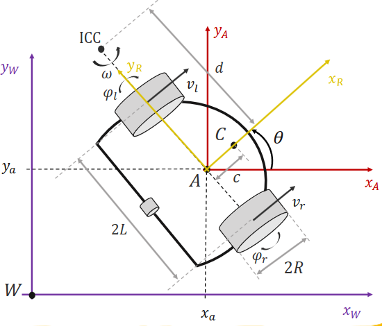

# Differential Drive Model

A differential wheeled robot is a mobile robot whose movement is based on two separately driven wheels placed on either side of the robot body. It can thus change its direction by varying the relative rate of rotation of its wheels and hence does not require an additional steering motion. Robots with such a drive typically have one or more castor wheels to prevent the vehicle from tilting;

We use the following notation for this project:

Translation:
$$
\mathrm{X}^{\mathrm{W}}:=\left[\begin{array}{c}
\mathrm{x}_{\mathrm{p}}^{\mathrm{W}} \\
\mathrm{y}_{\mathrm{p}}^{\mathrm{W}} \\
1
\end{array}\right]=\left[\begin{array}{ccc}
1 & 0 & \mathrm{x}_{\mathrm{A}} \\
0 & 1 & \mathrm{y}_{\mathrm{A}} \\
0 & 0 & 1
\end{array}\right]\left[\begin{array}{c}
\mathrm{x}_{\mathrm{p}} \\
\mathrm{y}_{\mathrm{p}} \\
1
\end{array}\right]=\mathbf{T} \mathbf{X}^{\mathrm{A}}
$$
___

Rotation:
$$
\begin{aligned}
&\mathrm{X}^{\mathrm{A}}=\left[\begin{array}{c}
\mathrm{x}_{\mathrm{p}} \\
\mathrm{y}_{\mathrm{p}} \\
1
\end{array}\right]=\left[\begin{array}{ccc}
\cos \theta & -\sin \theta & 0 \\
\sin \theta & \cos \theta & 0 \\
0 & 0 & 1
\end{array}\right]\left[\begin{array}{c}
x_p^R \\
y_p^R \\
1
\end{array}\right]=\mathbf{R}(\theta) \mathrm{X}^{\mathrm{R}}\\
&\begin{gathered}
\mathbf{R}(\theta) \in \operatorname{SO}(3) \\
\Rightarrow \mathbf{R}^{\mathrm{T}}(\theta)=\mathbf{R}^{-1}(\theta)
\end{gathered}
\end{aligned}
$$
___

Both:
$$
\mathrm{X}^{\mathrm{W}}=\mathbf{T X}^{\mathrm{A}}=\mathbf{T R}(\theta) \mathrm{X}^{\mathrm{R}}=\left[\begin{array}{ccc}
\cos \theta & -\sin \theta & \mathrm{x}_{\mathrm{a}} \\
\sin \theta & \cos \theta & \mathrm{y}_{\mathrm{a}} \\
0 & 0 & 1
\end{array}\right] \mathrm{X}^{\mathrm{R}}
$$

## References
1.<https://www.cs.columbia.edu/~allen/F17/NOTES/icckinematics.pdf>
2.<https://en.wikipedia.org/wiki/Differential_wheeled_robot>
3.<https://ethz.ch/content/dam/ethz/special-interest/mavt/dynamic-systems-n-control/idsc-dam/Lectures/amod/Lecture_13/20191104%20-%20ETH%20-%2001%20-%20Modeling.pdf>