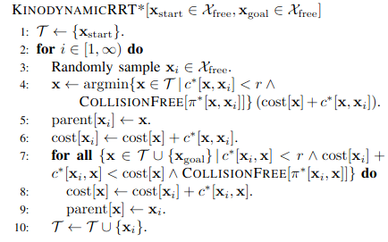
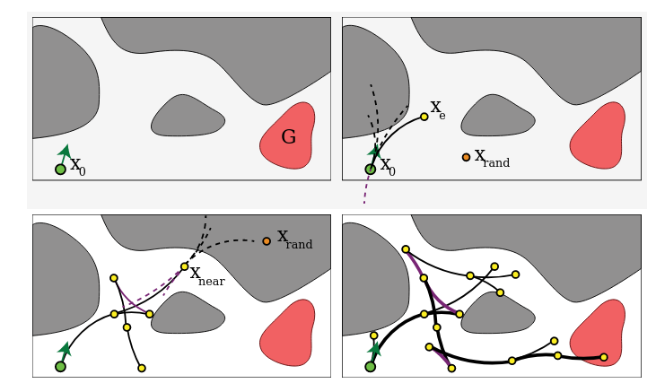

# Kinodynamic RRT*
This article introduces an incremental sampling-based approach designed for asymptotically optimal motion planning, specifically tailored for robots characterized by linear differential constraints. Building upon the foundation of RRT*—originally devised for holonomic robots—the proposed approach extends its capabilities by incorporating a fixed-final-state-free-final-time controller. This controller precisely and optimally connects any pair of states, considering a cost function that strikes a balance between trajectory duration and control effort.

The efficacy of this approach is demonstrated through the computation of asymptotically optimal trajectories in three distinct motion planning scenarios. These scenarios include a planar robot with a 4-dimensional state space and double integrator dynamics, an aerial vehicle with a 10-dimensional state space and linearized quadrotor dynamics, and a car-like robot with a 5-dimensional state space and non-linear dynamics.

The sampling-based planner employed in this work utilizes probabilistic roadmaps and rapid-exploring random trees. Additionally, the paper delves into the computational complexity theory, categorizing the problem at hand as PSPACE-hard—a class of decision problems solvable by a Turing machine with polynomial space.

While PRM (Probabilistic Roadmaps) and RRT (Rapidly-exploring Random Trees) are asymptotically complete, the article acknowledges the practical success of RRT* but highlights its limitation to systems with simple dynamics. RRT* relies on the ability to connect any pair of states with an optimal trajectory, making it primarily suitable for holonomic robots.

In contrast, the proposed algorithm in this paper addresses the limitation by designing a method capable of optimally connecting states in the state-space, accommodating control inputs and boundary conditions. The algorithm showcases its efficiency, particularly for holonomic robots, and its potential applicability to kinodynamic systems by linearizing nonlinear dynamics.

The paper emphasizes the importance of considering differential constraints in kinodynamic systems, where straight-line connections between states are typically invalid trajectories. It introduces a two-point boundary value problem for these systems.

In summary, this article contributes a novel algorithm for optimal trajectory generation, considering state-space dynamics, collision avoidance, and adherence to dynamic constraints. The proposed method exhibits efficiency and applicability to various robotic systems, showcasing its potential impact on kinodynamic planning in complex scenarios.

## Kinodynamic Planning

In the realm of robotics and motion planning, kinodynamic planning constitutes a class of challenges where stringent constraints related to velocity, acceleration, and force/torque must be adhered to. The objective of kinodynamic planning revolves around navigating a robot from an initial state to a designated goal region, all while circumventing obstacles and adhering to both kinematic and dynamic constraints. These constraints dictate the intricate relationship between a robot's controls and its motion. The term "kinodynamic" was first introduced in 1993, marking a pivotal moment in the evolution of planning methodologies. Within kinodynamic planning, a vehicle's dynamics are treated differentially, providing a nuanced understanding of its motion characteristics.

## References

1.<https://stanfordasl.github.io/wp-content/papercite-data/pdf/Schmerling.Pavone.EOR19.pdf>
2.<https://en.wikipedia.org/wiki/Kinodynamic_planning>